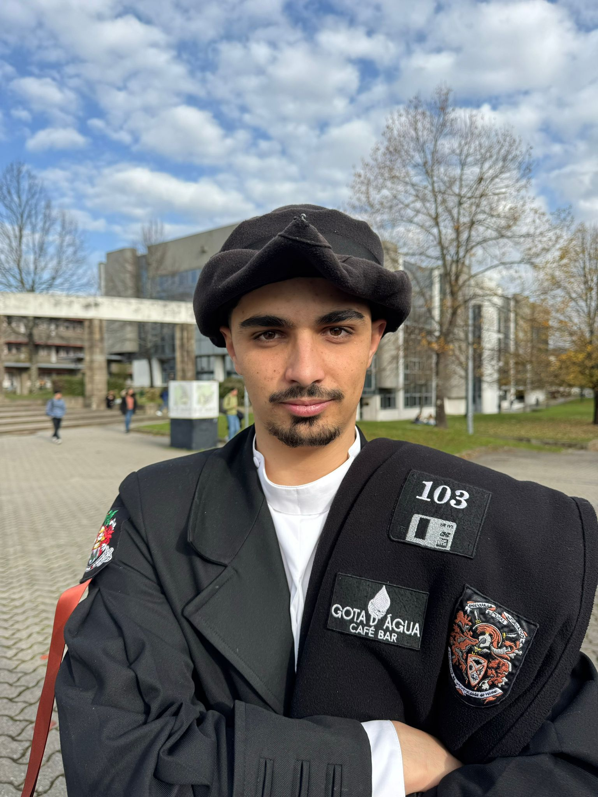

# PL2025-A104539

Processamento de Linguagens 2024/2025

## Autor 

- **Nome:** João Pedro Ferreira e Ferreiraa
- **Número:** A104539

## Resumo 

Repositório relacionado à unidade curricular Processamento de Linguagens lecionada no letivo 2024/2025
